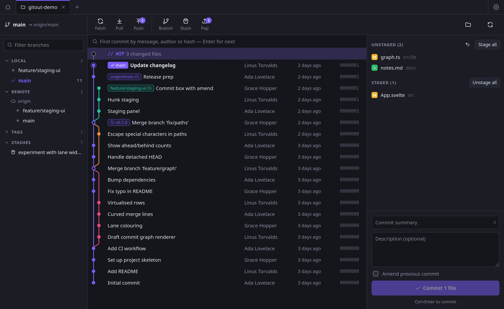
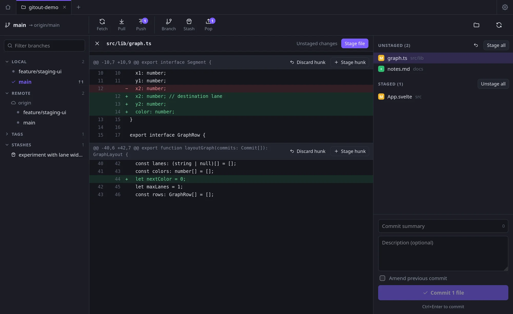
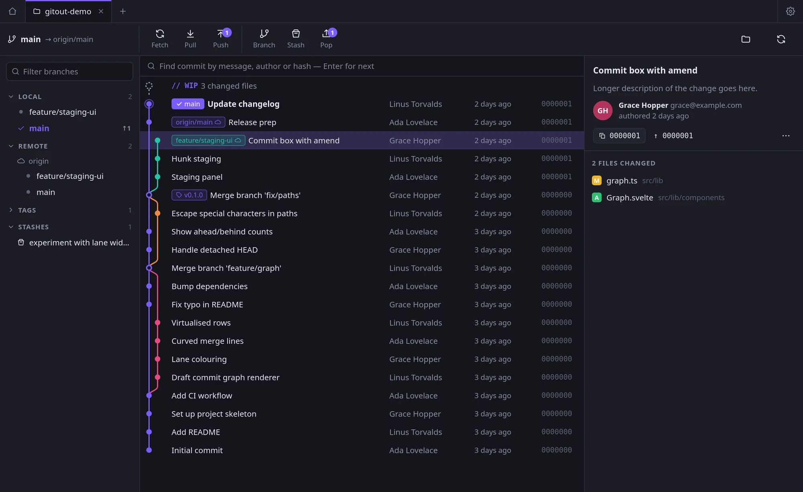
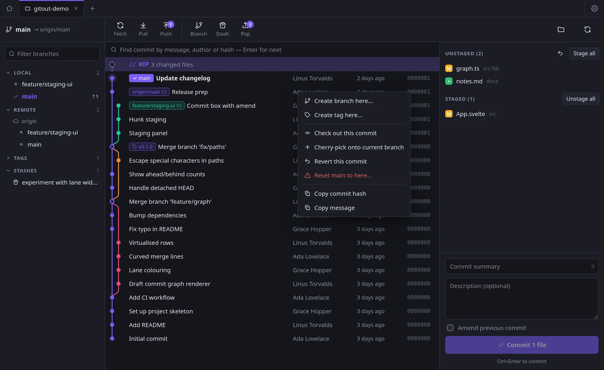
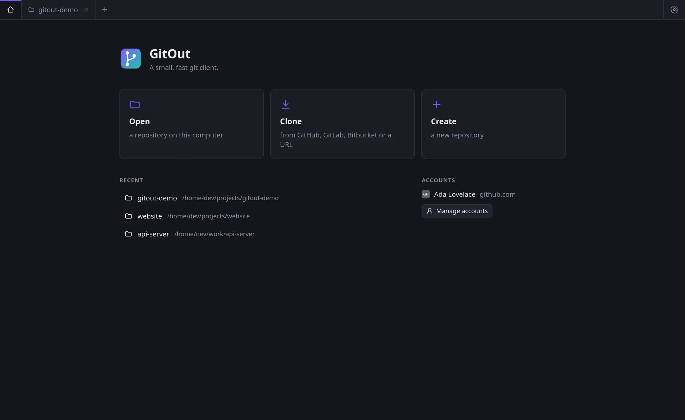
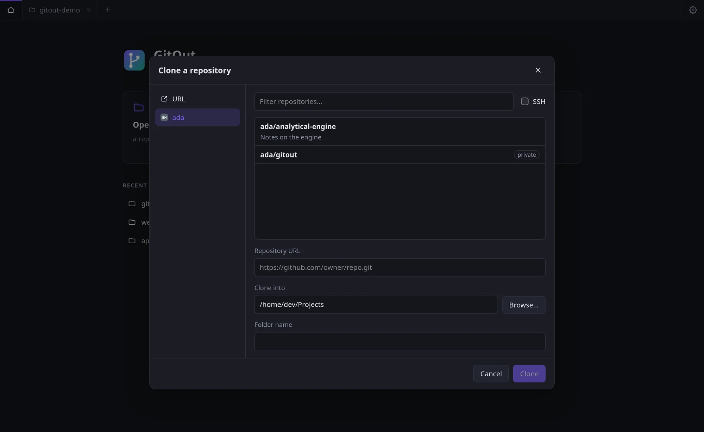
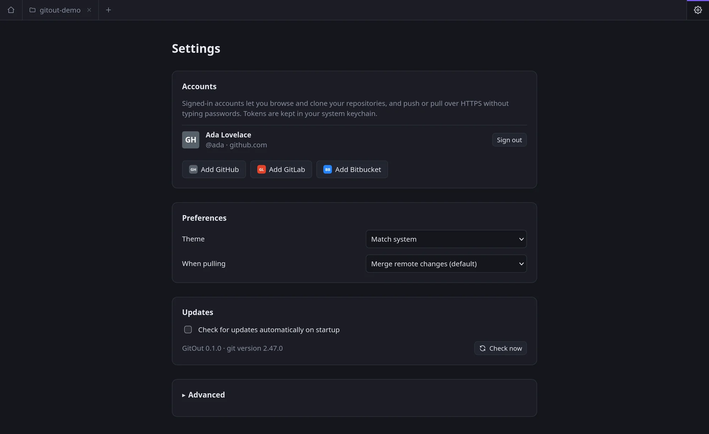

# GitOut

A small, fast, cross-platform desktop git client for Linux and Windows.



- **Lightweight**: built with [Tauri 2](https://tauri.app) on the system webview, so installers are around 10 MB instead of 150+ MB for Electron apps. The UI is Svelte 5 with no component framework (about 45 KB gzipped).
- **Your git, not a reimplementation**: it runs the `git` you already have. SSH keys, credential helpers, hooks, `.gitconfig`, LFS and signing all behave exactly as they do in your terminal.
- **Easy**: commit graph, one-click stage/unstage, hunk staging, commit and amend, branches, merge and rebase, cherry-pick, revert, reset, tags, stashes, and push/pull/fetch with ahead/behind counts. Right-click anything for more.
- **Sign in** to GitHub, GitLab (including self-hosted) and Bitbucket. Browse and clone your repositories, and push over HTTPS without passwords. Tokens live in the OS keychain.
- **Auto-updates** from signed GitHub Releases.

## Screenshots

| | |
| --- | --- |
|  |  |
| Hunk staging | Commit details |
|  |  |
| Commit actions | Home |
|  |  |
| Clone from your accounts | Settings |

## Development

Prerequisites: [Node 20+](https://nodejs.org), [Rust](https://rustup.rs) and git.

**Linux** (Debian/Ubuntu) also needs:

```bash
sudo apt install libwebkit2gtk-4.1-dev librsvg2-dev patchelf libdbus-1-dev build-essential
```

On Fedora, install `webkit2gtk4.1-devel librsvg2-devel dbus-devel`. For other distributions, see [Tauri's prerequisites](https://v2.tauri.app/start/prerequisites/).

**macOS** needs the Xcode command line tools. **Windows** needs the MSVC build tools and WebView2, which is preinstalled on Windows 10 and 11.

```bash
npm install
npm run tauri dev       # run the app with hot reload
npm run tauri build     # build installers into src-tauri/target/release/bundle
```

To work on the UI only, run `npm run dev` and open <http://localhost:1420> in a browser. Without Tauri the app uses a mock backend with sample data (`src/dev/mock.ts`).

Checks:

```bash
npm run check                                   # svelte + TypeScript
cargo test --manifest-path src-tauri/Cargo.toml # git output parsers
```

## Project layout

```
src/                      Svelte frontend
  lib/api.ts              typed wrappers for every backend command
  lib/graph.ts            commit-graph lane layout
  lib/repo.svelte.ts      per-repository state + actions
  lib/components/         UI
src-tauri/src/
  git.rs                  runs git, parses porcelain/log/ref output
  commands.rs             Tauri commands exposed to the UI
  auth.rs                 OAuth device flow, tokens, provider APIs
  store.rs                settings (JSON in the OS config dir)
```

## Sign-in

| Provider  | Browser sign-in             | Token sign-in                         |
| --------- | --------------------------- | ------------------------------------- |
| GitHub    | OAuth device flow           | Personal access token                 |
| GitLab    | OAuth device flow           | Personal access token                 |
| Bitbucket | Not available (no device flow) | Atlassian API token + account email |

Browser sign-in needs an OAuth app. The client IDs are public, and the device flow uses no client secret.

- **GitHub**: Settings → Developer settings → OAuth Apps → New. Tick **Enable Device Flow**.
- **GitLab**: User settings → Applications. Untick **Confidential** and choose the scopes `api`, `read_user` and `write_repository`.

Provide the IDs at build time with the `GITOUT_GITHUB_CLIENT_ID` and `GITOUT_GITLAB_CLIENT_ID` environment variables (the release workflow reads them from repository **variables**), or paste them under **Settings → Advanced** in the app.

For HTTPS remotes on a signed-in host, GitOut passes the token to git through `GIT_CONFIG_*` environment variables, scoped to that host. The token never appears in process arguments or in your git config. SSH remotes use your normal SSH setup.

If no system keychain is available (for example a bare window manager without gnome-keyring), tokens fall back to a user-only (0600) file in the config directory.

## Releasing and auto-update

1. Generate a signing key once: `npx tauri signer generate -w ~/.tauri/gitout.key`. Put the public key in `plugins.updater.pubkey` in `src-tauri/tauri.conf.json`.
2. Add the repository secret `TAURI_SIGNING_PRIVATE_KEY` with the contents of the private key file. If your key has a password, also add `TAURI_SIGNING_PRIVATE_KEY_PASSWORD` and pass it to the tauri-action step in `release.yml`.
3. Set `plugins.updater.endpoints` to `https://github.com/<owner>/GitOut/releases/latest/download/latest.json`.
4. Bump the version in `package.json`, `src-tauri/Cargo.toml` and `src-tauri/tauri.conf.json`, then push a tag:

   ```bash
   git tag v0.2.0 && git push origin v0.2.0
   ```

The release workflow builds the AppImage, .deb and .rpm (Linux) and the MSI and NSIS installers (Windows). The workflow signs the update bundles and publishes `latest.json`. Installed apps check for updates on startup.

On Linux, in-place auto-update works for the **AppImage**. The .deb and .rpm packages are updated by your package manager.
